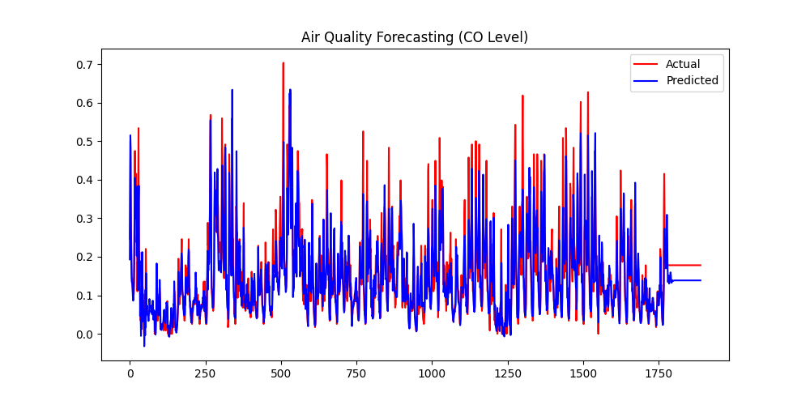

# AirAware - An Air Quality Predictor

Air pollution has emerged as a critical global issue, posing serious threats to public health and environmental sustainability. Accurate forecasting of air quality is essential for enabling timely interventions and informed decision-making.

**AirAware** focuses on forecasting air pollution using **LSTM (Long Short-Term Memory)** neural networks trained on the **UCI Air Quality dataset**. It targets key pollutants such as:

- Carbon Monoxide (CO)
- Benzene (C₆H₆)
- Nitrogen Oxides (NOx)
- Nitrogen Dioxide (NO₂)
- Non-Methane Hydrocarbons (NMHC)

---

## ⚙️ Features

- Time-series forecasting using deep learning
- Data preprocessing including:
  - Cleaning missing or corrupted values
  - Normalization
  - Reshaping for sequential LSTM input
- Model evaluation using:
  - Root Mean Squared Error (RMSE)
  - R² Score

---

## 🧠 Tech Stack

- Python 🐍
- TensorFlow / Keras (LSTM)
- NumPy, Pandas, Matplotlib
- Scikit-learn

---

## 📊 Model Performance

The LSTM model is trained to capture temporal dependencies in the pollutant data, providing accurate short-term forecasts. Evaluation metrics show that LSTM performs effectively in recognizing trends:

- **RMSE**: Captures average prediction error
- **R² Score**: Indicates model's predictive strength

  

---

## 🗂️ Dataset

- Source: [UCI Air Quality Data Set](https://archive.ics.uci.edu/ml/datasets/Air+Quality)
- Format: Time-series sensor readings for urban air pollution levels

---

## 🚀 How to Run

```bash
# Create a virtual environment (optional)
python -m venv env
source env/bin/activate   # or .\env\Scripts\activate on Windows

# Install dependencies
pip install -r requirements.txt

# Run the predictor script
python AirAware.py
